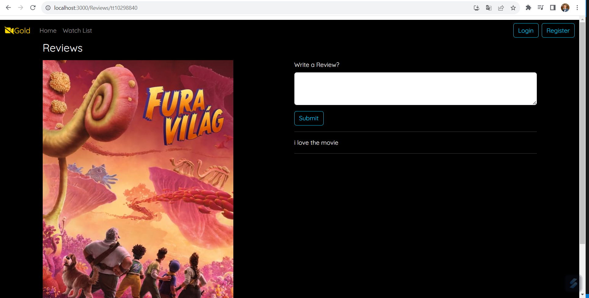
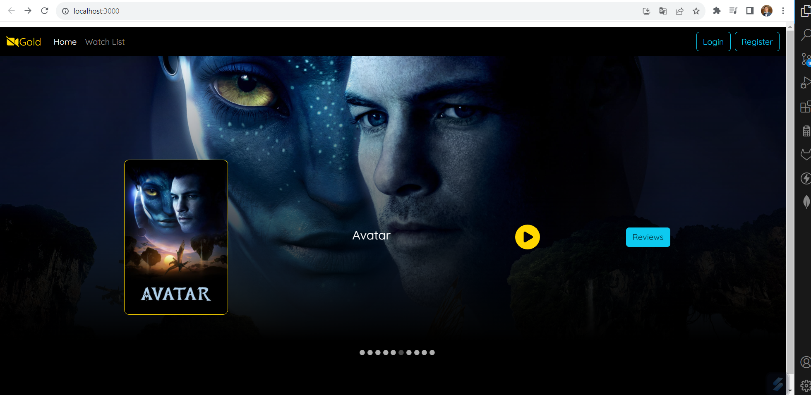

# CineOpinions
J'ai développé CinéOpinions, une application web intégrant Java Spring Boot, React et MongoDB. Cette plateforme offre aux utilisateurs une expérience immersive pour rechercher des films et partager leurs avis. 
Son interface fluide permet une navigation aisée, tout en offrant la possibilité aux utilisateurs de découvrir, évaluer et commenter les films. 
CinéOpinions vise à simplifier la recherche cinématographique tout en favorisant l'interaction communautaire à travers des fonctionnalités conviviales d'avis et de notation.

[English]

I have developed CinéOpinions, a web application built using Java Spring Boot, React, and MongoDB. This platform provides users with a seamless experience to search for movies and share their reviews.
Its smooth interface enables easy navigation while allowing users to discover, rate, and comment on movies. 
CinéOpinions aims to simplify movie exploration while fostering community interaction through user-friendly review and rating features.

